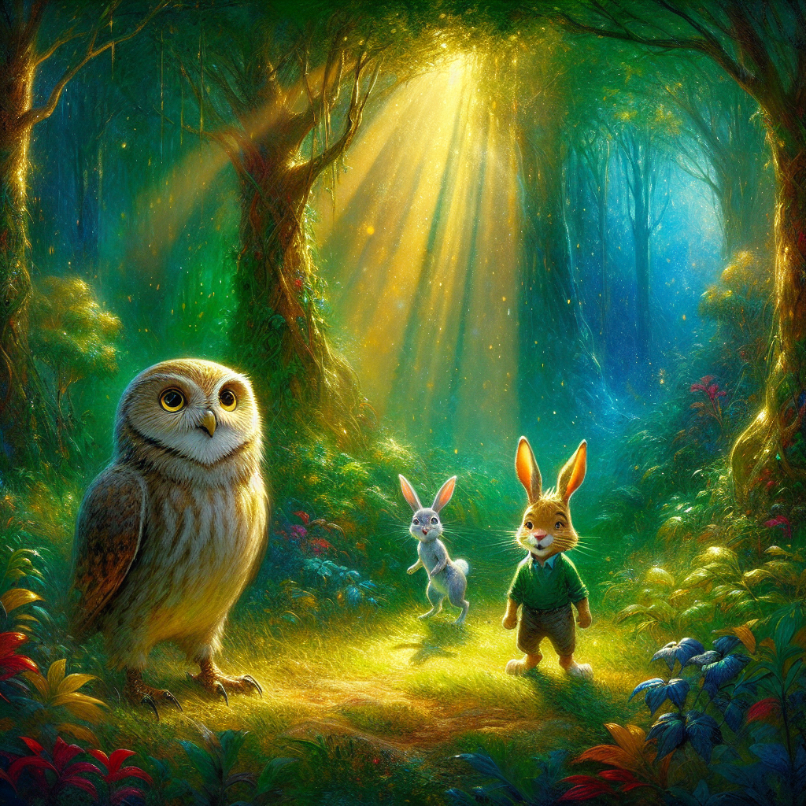
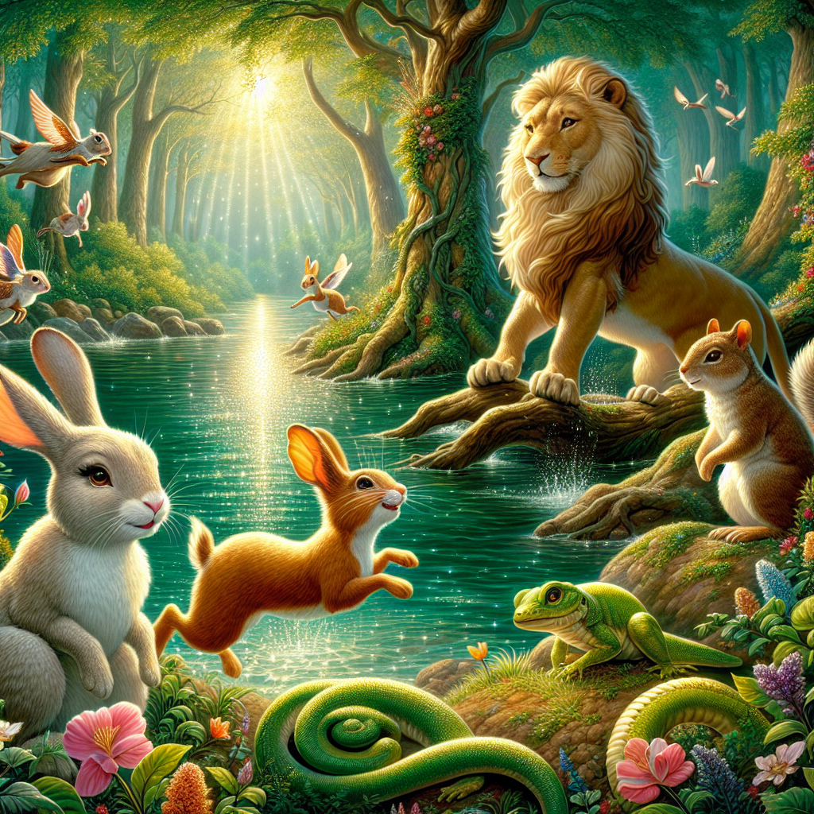
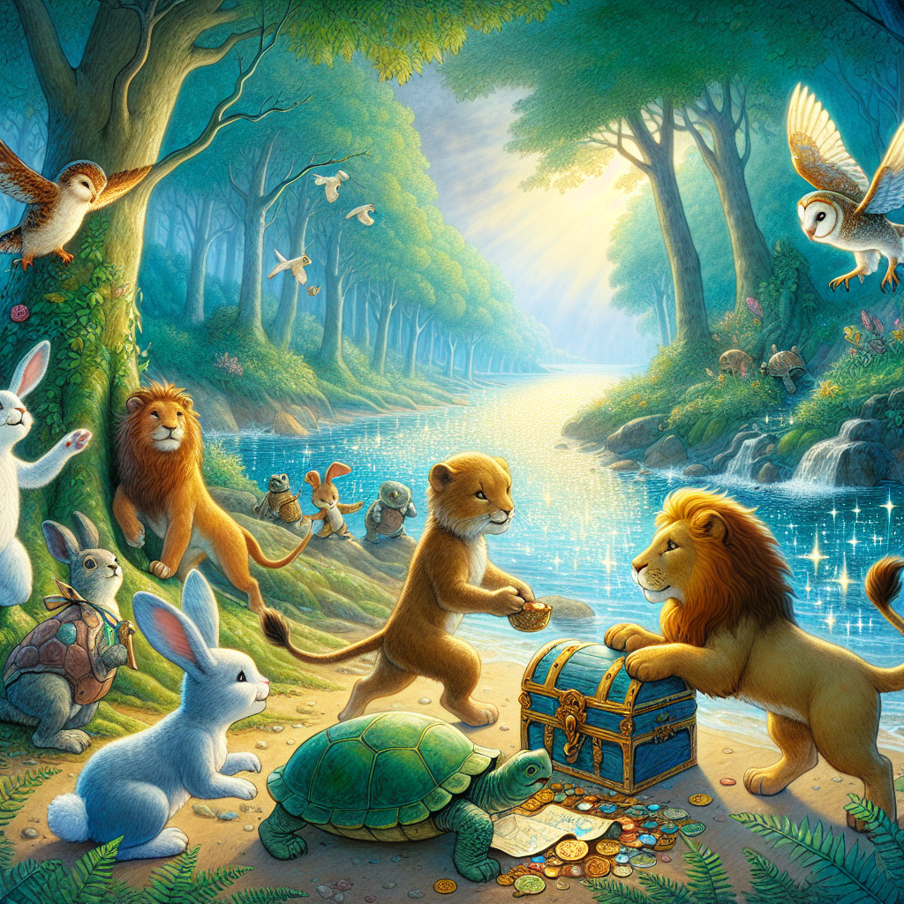
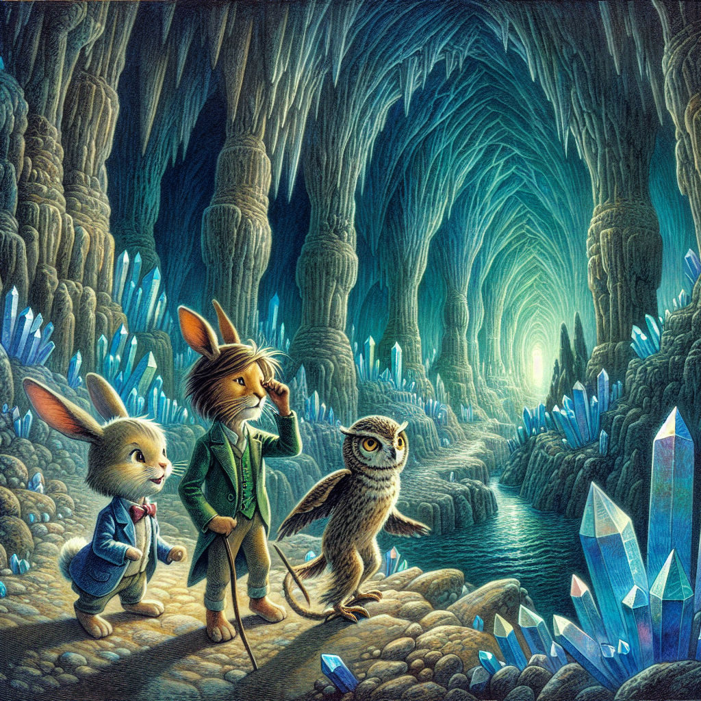
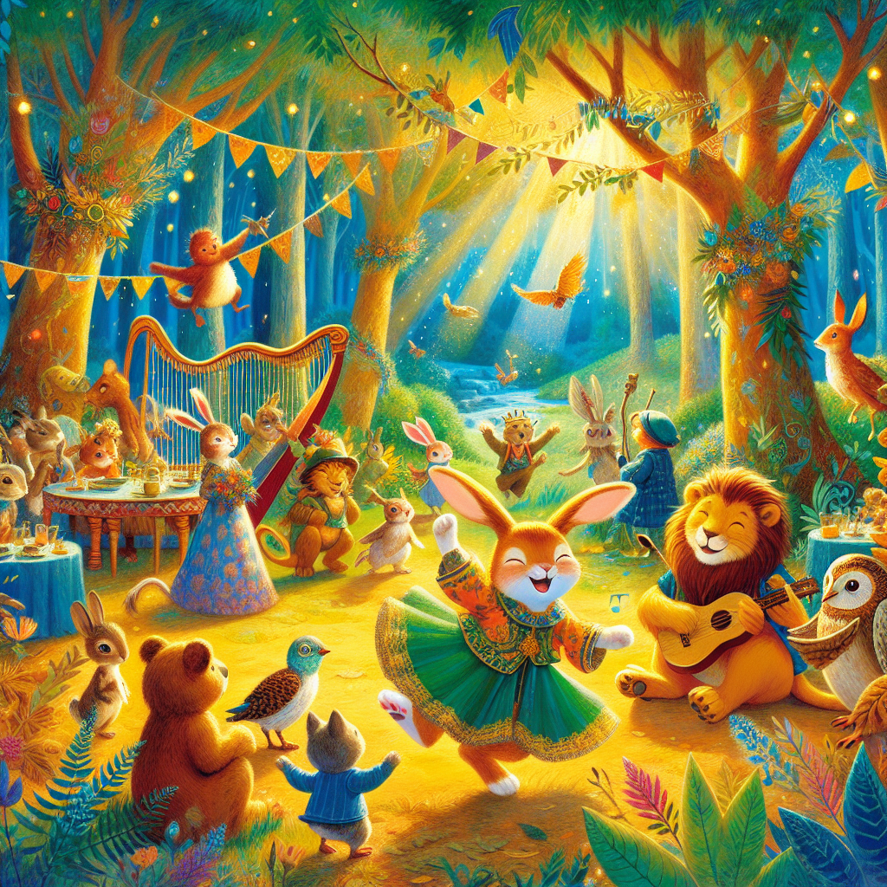

# The Animal Adventure Club

## Chapter 1: The Secret Meeting in the Forest

In a hidden clearing deep in the heart of the forest, the sunlight streamed through the leaves, dancing gracefully on the forest floor. It was here that Oliver the Owl had decided to call a secret meeting of his friends. His small, round glasses perched on his beak as he adjusted them thoughtfully while he awaited the arrival of his companions.

“Today’s the day!” Bella the Bunny exclaimed, her big floppy ears flapping eagerly as she arrived, hopping with excitement. “What’s our adventure going to be, Oliver?” Her playful energy was contagious, and the thought of exploring the wonders of the forest made her heart race.

“Hello, Bella,” Oliver greeted with a warm twinkle in his wise old eyes. “I summoned you all here, because I think it’s time for us to embark on an entirely new journey.”

Just then, Leo the Lion emerged from behind a shrub, his golden mane glinting in the sunlight. “What do you have in mind, Oliver?” he asked, his voice steady and strong, instilling confidence among the group. Leo had always been their protector, and his presence was enough to make any challenge seem surmountable.

“We should form an ‘Animal Adventure Club’!” Bella suggested enthusiastically. “We could explore the forest and uncover its many mysteries together!” 

Oliver nodded in agreement, a soft smile gracing his beak. “That’s a wonderful idea, Bella. Together, we can share our discoveries and learn even more from one another.” 

Leo’s eyes gleamed with excitement. “I’ll lead our first expedition! Together, we have the power of teamwork, and there’s nothing we can’t do if we work together.” He puffed out his chest, ready to embrace the adventure that lay ahead.

The three friends discussed their plan in detail, their imaginations soaring with the possibilities of what lay beyond the trees. They spoke of shimmering lakes, tall mountains, and secrets hidden under every rock and leaf. Finally, it was decided: they would set off on their grand adventure the very next day, full of anticipation.

As the sun dipped below the horizon, painting the sky with hues of orange and purple, Oliver, Bella, and Leo exchanged excited glances, fueled by the thrill of the unknown. Little did they know, this was only the beginning of their thrilling escapade—a journey that would lead them to discover treasures and friendships like they had never imagined.

## Chapter 2: The Mysterious River

The dawn was bursting with life as the friends gathered early for their much-anticipated expedition. Bella hopped in circles, her excitement infectious, while Leo offered encouraging words, reminding them to stay brave. Oliver, with a scroll tucked under his wing, led the way through the whispering trees toward their first destination.

After a cheerful trek, they approached a glistening river that sparkled like diamonds under the sun. The water bubbled and swirled, creating an enchanting symphony that captivated the adventurers. Sammy the Squirrel scampered down a tree, curiosity shining in his eyes. “Wow! Look at that river! I bet it holds some secrets. Let’s explore!”

At that moment, they heard a soft hiss and a sudden rustle. Lucy the Lizard blended into the grass nearby, peeking curiously at the group. “Did someone say secrets?” she asked with a sly grin. She was known for her stealth and knack for finding hidden paths. “I know how to get us across safely!”

“Lead the way, Lucy!” cheered Bella, bounding forward.

With nimble precision, Lucy hopped from stone to stone, showing them how to maneuver safely across the rocky riverbed. “Just watch your step!” she called out, her voice filled with encouragement. As they crossed, the shimmering water sparkled beneath them, making it an exhilarating adventure.

On the other side, Sammy noticed something shining beneath the water’s surface. He sprang up excitedly, his fluffy tail twitching. “Look over there! There’s something shiny reflecting the sunlight!” They all gathered around the riverbank, their eyes wide with wonder.

“What do you think it is?” Oliver pondered aloud, adjusting his glasses in anticipation.

“We should find out!” Sammy squeaked, his mischievous nature taking over. “I’m sure it’s something fabulous!” 

The Animal Adventure Club banded together, devising a plan to retrieve the shiny item. They decided Leo would help them wade carefully into the water while Lucy checked the position of the rocks. Bella’s quick thinking came into play as she offered to use a stick to poke around and see exactly what they were up against.

With teamwork, they carefully approached the mysterious shimmer. As they drew closer, the glint grew even brighter, sending ripples of excitement through the group. What they found would surprise them all, ensuring that this was just the beginning of their wondrous adventure together.

## Chapter 3: The Shiny Treasure

As they worked together, their hearts raced, and laughter filled the air. Leo steadied himself in the water with Bella at his side, guiding him toward the enigmatic shimmer. They soon discovered that the shiny object was a treasure chest, partly buried in the muddy riverbed.

“Look! It’s a treasure chest!” shouted Bella, her eyes gleaming with excitement. “But how do we get it out?”  

Tammy the Turtle, who had been leisurely basking under a nearby tree, saw the commotion and waddled over. “Just take your time,” she said wisely, her slow and steady demeanor calming the excitement buzzing around. “Let’s think it through.”  

“Oliver, do you have that map?” Leo asked. 

“Of course!” Oliver replied, unfurling the detailed map, wrinkles deepened from years of exploration. “Let’s see if there's a trick to opening it. Freddy the Fox has tales about these things.” As mentioned, Freddy was sly and clever, often known for his resourcefulness.

Freddy appeared just then, winking mischievously. “Did someone say treasure?” he grinned slyly, rounding the corner. He inspected the chest and began to examine it closely for any hidden mechanisms. “There are often traps around treasure chests. We need to be cautious!”

Everyone leaned in closer as Freddy pointed out different components of the chest. “Let’s combine our strengths: Oliver can read the map, Leo can use his strength to heave it up, and I’ll check for any tricks,” Freddy proposed enthusiastically.

With renewed energy, the friends worked together. Leo positioned himself at the side of the chest, and with a mighty pull, he began to lift it up from the mud. “Heave-ho!” he roared, his muscles straining as he managed to dislodge it. With a final grunt, it popped free, and the friends cheered with joy!

“Yes! Now let’s see what’s inside!” Bella hopped excitedly as Freddy carefully opened the latch. Inside, colorful gems glimmered like rainbows, filling their hearts with joy. Old maps were nestled beside the jewels, each labeled with unfamiliar names and coordinates, possibly leading to new adventures.

“This is incredible!” Lucy exclaimed, her eyes wide in awe. “We’ve hit the jackpot!” 

As they stood in amazement, they felt the thrill of discovery rushing through them. “Now that we have treasures, should we keep exploring?” asked Tammy, her turtle wisdom gleaming through. 

A consensus emerged. The excitement of their first treasure filled them with courage and aspirations for where their next adventure might take them. And so, they vowed to embark on their next journey, as a unified team, determined to see where their treasure maps would lead them across breathtaking lands.

## Chapter 4: The Journey to the Hidden Cave

Following the directions on one of the maps, the Animal Adventure Club set off through the forest, eager to uncover more secrets of the wilderness. Their hearts were filled with laughter and chatter as they relived tales of the treasure they’d just found.

Gina the Giraffe, with her towering height, spotted something strange peeking through the treetops. “Hey everyone, look! That hill seems to rise higher than the rest!” she called, her voice melodic and soothing. With her tall stature, she was able to see far and wide.

As they trotted forward, Hugo the Hedgehog waddled along, giving everyone tips on the various plants they’d come across. “Those berries over there are delicious, but don’t eat the red ones! They can be dangerous,” he warned sincerely, ensuring the friends were always safe.

Finally, they arrived at the entrance of a hidden cave, a sight that sent shivers of excitement down their spines. “This must be it! The hidden cave marked on our map!” Oliver exclaimed, adjusting his glasses with anticipation.

As they stepped inside, the darkness enveloped them, but with determination, they pressed forward. The cave walls sparkled with beautiful crystals that reflected light, casting shimmering features on the ground. However, the echoing sounds created a haunting atmosphere that filled them with a sense of trepidation.

“Stick together, everyone!” Leo declared, his deep voice resonating throughout the cavern. They needed courage—together, they could conquer anything that stood in their way. 

As deeper they went, the pathway twisted and turned, and soon they stumbled upon a series of mazes made of tall, prickly plants. Hugo quickly identified them. “Don’t worry! These are safe, and I can guide us through!” he assured.

With Hugo’s knowledge, they maneuvered the winding passages. Each step restored their confidence as they stayed true to their teamwork. A glimmer of light appeared as they reached a grand chamber, filled with crystals so radiant that they practically illuminated the cave.

The friends gasped in wonder. “This is incredible!” Bella shouted, hopping around in jubilation. “Look at all these stunning crystals!”

Yet, as they began to explore, shadows flickered across the walls, and the echoing sounds grew louder. Realizing that they were all feeling a bit anxious, Oliver reminded them, “We’re in this together. Courage is facing our fears side by side.”

With newfound bravery, they explored the chamber, learning to appreciate the beauty surrounding them. They discovered breathtaking crystal formations and enchanting echoes that would leave them with stories for years to come. Facing their fears made their bond stronger, and they understood that together they could conquer any challenge that life threw their way.

Finally, as they began to make their way back out, they knew that this treasure trove would forever be treasured not just for its crystals, but for the memories they created and shared together as friends.

## Chapter 5: The Great Animal Celebration

As the sun dipped low and the forest was bathed in rich golden hues, the Animal Adventure Club returned home, buzzing with excitement from their many adventures. Each friend couldn’t wait to share tales of their escapades—the treasure, the cave, and everything in between.

Once back at the hidden clearing, Oliver suggested, “Why don’t we celebrate our adventures together with a festival? Let’s invite all our forest friends!”

Bella clapped her paws in delight. “That’s a fantastic idea! We can share the treasure, the food, and tell stories of our adventures!”

They quickly set to work, planning every detail of their grand celebration. Sammy, with his lively nature, darted around gathering supplies to decorate the clearing with colorful leaves and flowers. Hugo enthusiastically helped collect delicious fruits, while Tammy brought along her favorite treats that were perfect for a feast.

As evening fell, animals of all shapes and sizes gathered at the clearing: rabbits, birds, deer, and even a vibrant peacock named Polka, who brought an array of colors to the party as she danced with flair.

“Welcome everyone!” Leo roared with joy, making sure every creature felt included. They shared stories about the treasure they’d found, the hidden cave, and everything they learned about courage and teamwork.

Oliver strummed his tiny harp and sang melodies that echoed in harmony with the laughter of their friends. Everyone danced around the clearing, twirling and hopping with glee, their souls ignited with the spirit of camaraderie.

Polka, in full delight, swirled around, singing songs and encouraging everyone to join her in a merry dance. “Let’s rejoice! For adventures await all who dare!”

As the festivities continued, the friends realized that the true treasure lay not just in the gems from their chest or the exotic treasures of the cave but in the bonds they created together. Their various personalities brought richness to the experiences, making each moment unique and unforgettable.

The night faded into a beautiful memory, where laughter echoed under the twinkling stars. The Animal Adventure Club learned that exploring together not only brought excitement but deepened their friendships, opening the doors for many more adventures to come.

As the mesmerizing night came to a close, they looked around at their friends, feeling grateful for the bond they shared. Together, they could face any challenge, navigate any maze, and discover the beauty of the world—together.

And so, with hearts full of adventure and joy, they left the clearing that night with a promise of more exciting chapters ahead. The Animal Adventure Club was just beginning their journey—endless tales of friendship, bravery, and treasure awaited!
